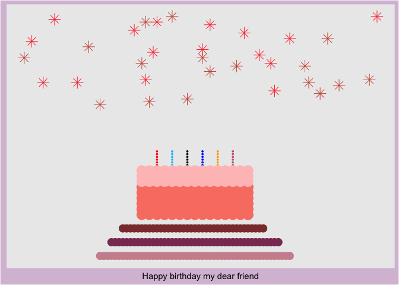

<!-- README.md is generated from README.Rmd. Please edit that file -->

# grcard

<!-- badges: start -->
<!-- badges: end -->

The goal of grcard is to created dynamic greeting cards - birthday card
and Christmas card.

## Installation

You can install the development version of grcard like so:

\[Github\]<https://github.com/tissuezhang/grcard>

## Example

This is a basic example which shows you how to create a GIF card:

``` r
library(grcard)
bdcard<-bday_card(greeting = "Happy birthday my dear friend", color = "strawberry")
bdcard
```


